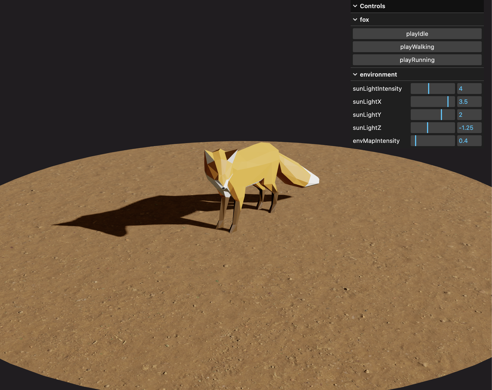

## Live
[Live](https://fox-ddza1xg03-olivias-projects-aaec2529.vercel.app/)


## Setup
Download [Node.js](https://nodejs.org/en/download/).
Run this followed commands:

``` bash
# Install dependencies (only the first time)
npm install

# Run the local server at localhost:8080
npm run dev

# Build for production in the dist/ directory
npm run build
```
## Debug
Add `#debug` to the end of the website address —  
you can then twist the controls.

